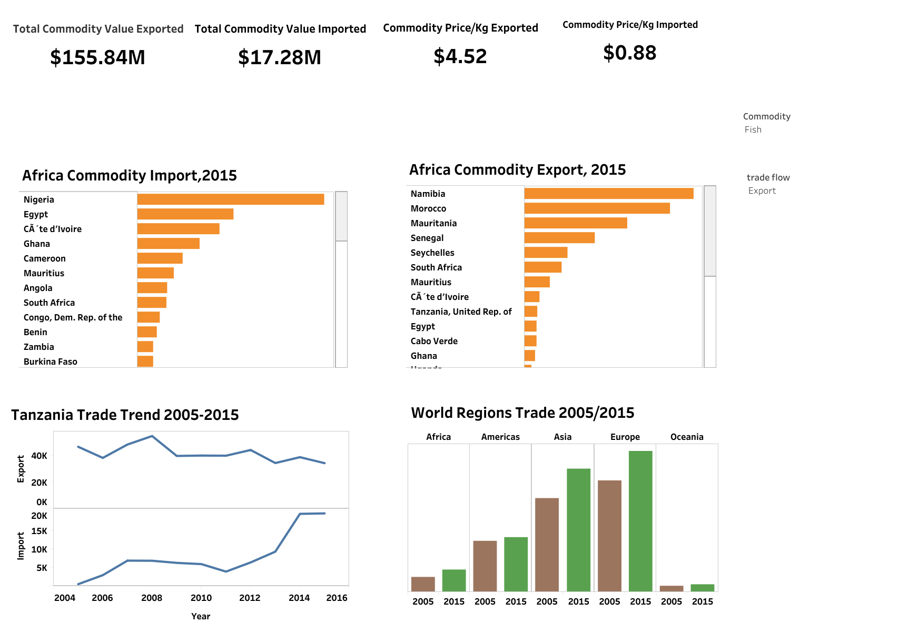

# Trade Analysis of Aquaculture Products

Aquaculture is the controlled cultivation (“farming”) of aquatic organisms such as fish, crustaceans, mollusks, algae, and other organisms of value such as aquatic plants. For this project, only two commodities were analyzed (fish and crustaceans). The analysis is narrowed down to a country (Tanzania) but also looking the condition of trade as a whole from 2005–2015

## Project Task
Examining the condition of trade of aquaculture products from 2005-2015

## Skills and Tools
* Data visualisation on Tableau
* Microsoft SQL server management studio. Click [here](trade.sql) to access it

## Guideline Questions
* what were the largest importers in the world in 2005 and 2015?
* what were Africa’s largest exporters (fish, crustaceans) in 2015?
* what were Africa’s largest importers (fish, crustaceans) in 2015?
* what was the price of exported commodities in Tanzania, in 2015?
* what was the price of imported commodities in Tanzania, in 2015?
* what was the condition of trade in Tanzania from 2005 to 2015?

## Dashboard

You can interact with it [here](https://public.tableau.com/app/profile/godbless.urassa/viz/TradeAnalysis_16794720861010/Dashboard1?publish=yes)

## Insights
* Europe was the largest importer of crustaceans and fish followed by Asia in 2005 and 2015
* Namibia was the largest exporter of fish while Morocco is the largest exporter of crustaceans
* Nigeria is the largest importer of fish while Morocco is the largest importer of crustaceans
* In Tanzania, the exportation of 1 kilogram costs $4.52 while importation costs $0.88
* 2008 Tanzania exported a large number of commodities (55,036 tons) compared to other years, from 2009 exportation was very low towards 2015 (34,485 tons) while importation increased to its maximum in 2014 (19,489 tons) and 2015 (19,611 tons). This may be caused by low production and poor policies in trading

## Recommendations
* Asia and Europe had assured markets for fish and crustaceans while Nigeria and Morocco had good markets for fish and crustaceans
* The government was supposed to amend its policies to enhance productive trading and also facilitate farmers to increase the production of fish and crustaceans
